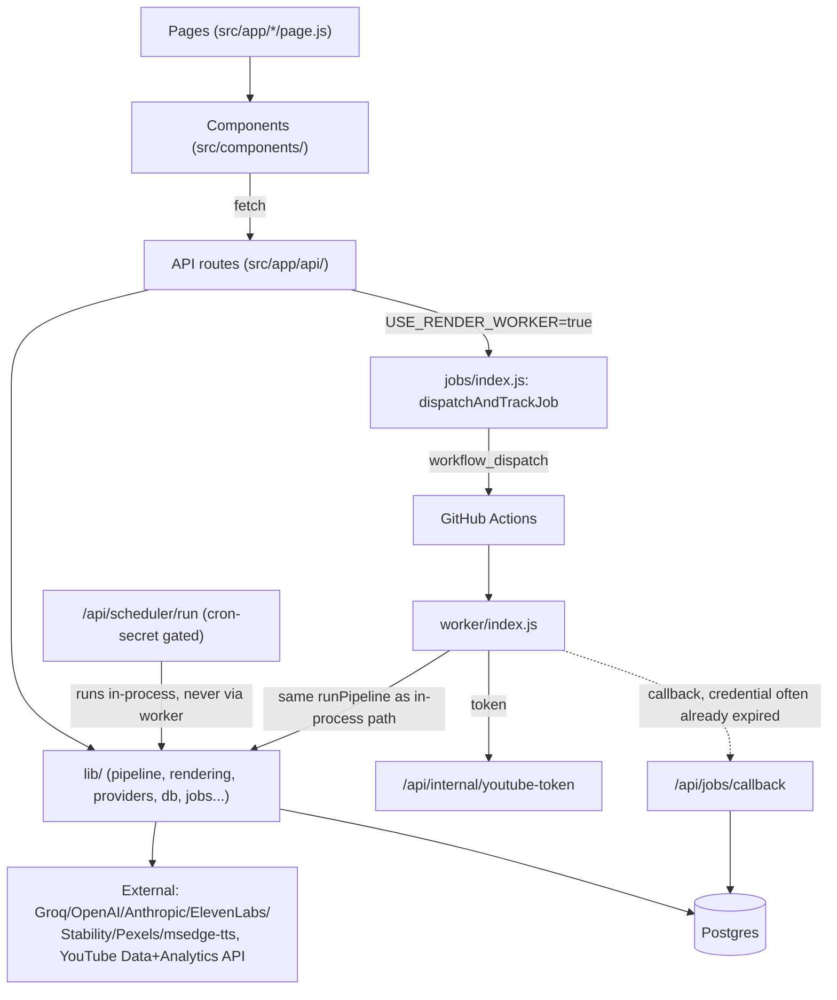

# The Mindful Path — Studio: Project State (current snapshot)

> **For AI assistants:** this file is a **current-state snapshot**, not a
> history — it describes what the codebase looks like *right now*, so
> that pasting this one file in is enough to get full context without
> uploading the repo. It's the companion to `ROADMAP.md`, which stays
> append-only (full chronological changelog, never edited in place).
> Read both: this file for "what exists today", `ROADMAP.md` for "why,
> and what was tried before."
>
> **Keep this file in sync going forward:** whenever a change affects
> architecture, data flow, the DB schema, required env vars, or the
> status of a known issue listed here — **edit the relevant section of
> this file in place** (don't append, don't leave the old version
> alongside the new one) **in the same session**, right after adding the
> matching entry to `ROADMAP.md`. Small/cosmetic changes (styling, copy
> text, a single bug fix that doesn't change any of the above) only need
> the `ROADMAP.md` entry. If in doubt, update this file too — it's
> cheaper than the next session re-deriving stale context from it.
>
> **Last synced against:** commit `6e593d5` (2026-08-26), verified
> directly against the extracted source (not just commit messages) as
> part of a full review — see `youtube-studio-review-v2.md` for the
> detailed bug-by-bug audit this snapshot draws its "Known issues"
> section from.

## What this is

An automated YouTube content pipeline for **The Mindful Path** — a
mindfulness/personal-growth channel hosted by an animated character
named Maya. One person runs the whole channel through this app: pick a
topic (or let AI pick one), AI writes the script, AI generates voice +
matching stock footage, the server renders the final video, uploads
straight to YouTube with an AI-suggested title/description/tags, a
custom Maya thumbnail, and subtitles in 5 languages. Maya herself only
appears on the thumbnail (`rendering/mayaThumbnail.js`) — the video body
is 100% stock Pexels footage matched to script keywords; there is no
Maya compositing inside the actual video frames (corrected 2026-08-29 —
this summary previously and inaccurately said "animated Maya overlays"
as if she appeared in-video; `pickMayaPose()` is reused during media
search purely to bias which stock-footage mood to look for, which is
where that confusion came from).
Also includes a standalone AI Studio (text/image/video/audio generation
tools, independent of the video pipeline), automatic scheduling, A/B
title testing, Community-tab post drafts, and long→short repurposing.

## Tech stack

| Layer | Choice |
|---|---|
| Framework | Next.js 16 (App Router), React 19, `"type": "module"` |
| Hosting | Render.com, **free tier — 512MB RAM, shared CPU** |
| Render worker (optional) | GitHub Actions (`workflow_dispatch`), 45-min timeout — see "Worker/job flow" below |
| Auth | NextAuth v4 + Google OAuth (YouTube scopes) |
| AI providers (text/image/video/audio) | Pluggable — see "Provider system" below. Any of Groq/OpenAI/Anthropic/ElevenLabs/Stability AI/Pexels/msedge-tts, user-configured per task with automatic fallback |
| Video render | Server-side FFmpeg (`@ffmpeg-installer/ffmpeg`, static ~2018 build — missing some modern filter options) |
| YouTube | `googleapis` (Data API v3 + Analytics API v2) |
| Database | Postgres via `pg` (Supabase-hosted, raw connection string) |
| Images | `sharp` (thumbnail compositing) |
| Styling | Tailwind CSS 4, dark navy/violet design system (`globals.css`, "Dark Futuristic AI Dashboard", 2026-08-22) |

## Known constraints

Real, currently-active limits — worth reading before proposing a fix
that assumes they don't exist:

- **Render.com free tier: 512MB RAM, shared CPU.** Drives the single
  biggest rendering choice: every media segment renders in its own
  isolated FFmpeg process, one at a time (never in parallel, never all
  loaded into one giant filter graph) — the `BATCH_SIZE=1` constant in
  `rendering/index.js` documents this even though it's no longer
  exported/consumed directly.
- **The bundled FFmpeg binary is a static build from ~2018.** Missing
  some modern filter options (confirmed the hard way: `scale`'s
  `force_divisible_by` crashed with "Option not found"). Prefer filters/
  options that existed since FFmpeg 3.x/early 4.x, or compute the
  equivalent value in JS ahead of time.
- **msedge-tts's SSML support is unreliable** (unofficial wrapper
  around Edge's read-aloud service, not the real Azure Speech SDK) —
  don't rely on `<break>`/prosody tags. Audio ducking reacts to the real
  narration waveform (`sidechaincompress`) instead of SSML timestamps
  for this reason.
- **No test runner installed** (no jest/vitest/mocha). `tests/*.test.mjs`
  use only Node's built-in `assert`, run directly via
  `node tests/whatever.test.mjs`. `scriptTiming.test.mjs` has zero
  dependencies; `pipelineChecks.test.mjs` needs `npm install` first.
- **`package.json` has had `"type": "module"` since 2026-08-17.** An
  older note in `ROADMAP.md` (2026-08-12) says plain `node --check` is
  unreliable on these files and recommends checking a `.mjs` copy
  instead — that note predates the `"type": "module"` addition and may
  no longer apply. Worth re-verifying before trusting either claim.
- **YouTube's Data API v3 doesn't expose comment pinning, real
  Community-tab posting, End Screens/Cards, or simultaneous A/B split
  testing.** `community/route.js` only ever produces a manual-post
  *draft*; `ab-test/route.js` does a sequential live switch, not real
  split testing.
- **`public/fallback-media/videos/` ships empty** (`images/` has real
  files). The fallback mechanism in `providers/router.js` is fully
  wired up; if every configured stock provider fails for video AND the
  fallback folder is empty, the original error still surfaces — this is
  intentional, not a bug.
- **`globals.css`: avoid `@apply` for utilities that aren't also a
  literal className somewhere in JSX** — Tailwind v4's content-scanner
  only resolves `@apply` against utilities it already found as literal
  classNames; a value used only inside `@apply` (e.g. `gap-1.5`) broke
  the build with "Cannot apply unknown utility class". Every custom
  class in `globals.css` is now plain CSS against `@theme` vars instead.

## Architecture



Since 2026-08-18, `worker/index.js` doesn't duplicate render logic — it
calls the exact same `pipeline.js: runPipeline()` as the interactive
and scheduled paths, just with a different `getUploadAccessToken`
source. One pipeline implementation, three ways to trigger it.

## File map

### Pages (`src/app/`)
- `page.js` — home: sign-in gate, then `DashboardSummary` *(new,
  2026-08-31 — live Trend Finder pending count, schedule status, recent
  activity, fetched from the same existing `/api/trends`+`/api/schedules`
  +`/api/activity` endpoints, no new API surface)*, then the original
  section cards (long/short/analytics/api-check/schedule/providers/
  ai-studio)
- `layout.js` — RTL Persian layout, Vazirmatn font
- `providers.js` — NextAuth `SessionProvider` wrapper (name collision
  with the `providers/` route/page below is coincidental)
- `globals.css` — Tailwind v4 + design tokens
- `long/page.js`, `short/page.js` — render `VideoStudio` with
  `mode="long"` / `"short"`
- `analytics/page.js` — renders `ChannelAnalytics`
- `api-check/page.js` — renders `ApiStatus`
- `schedule/page.js` — renders `ScheduleSettings`
- `providers/page.js` — renders `ProviderManager`
- `ai-studio/page.js` — renders `AIStudio`
- `trends/page.js` *(new, 2026-08-27)* — renders `TrendFinder`; the 6-hourly
  scored-topic queue described under "Trend Finder" below
- `activity/page.js` *(new, 2026-08-29)* — renders `ActivityFeed`; a
  site-wide event log (uploads, trend scans, scheduled runs, repurpose,
  community-post drafts) described under "Activity log" below

### API routes (`src/app/api/`)
- `generate-script/route.js` — wraps `lib/script/index.js: generateScript()`
- `generate-and-upload/route.js` — main manual entry point; streams
  NDJSON progress; runs `pipeline.js: runPipeline()` in-process, or (if
  `USE_RENDER_WORKER=true`) dispatches via `jobs/index.js:
  dispatchAndTrackJob()` and the client polls job status separately
- `images/route.js`, `clips/route.js` — thin wrappers around
  `lib/media/index.js`
- `tts/route.js` — voice preview
- `suggest-metadata/route.js` — wraps `lib/metadata/index.js: generateMetadata()`
- `upload/route.js` — manual path: user uploads an already-made video
  file directly, still gets a Maya thumbnail (via
  `getMayaThumbnailExports()`)
- `sync-stats/route.js` — pulls views/subscribers/likes/retention/
  thumbnail CTR from YouTube Analytics into the DB
- `videos/route.js` — lists recorded videos (analytics page)
- `status/route.js`, `status/groq`, `status/pexels`, `status/youtube` —
  legacy raw-env-var connectivity checks, separate from the provider
  system below
- `auth/[...nextauth]/route.js` (+ `lib/auth/authOptions.js`) — Google
  OAuth, JWT refresh using `account.expires_at`, persists
  `refresh_token` to the DB on sign-in
- `community/route.js` — generates + stores a Community-tab post draft
  via `lib/community/index.js`
- **`comments/route.js`** *(new, 2026-08-30 — wires up `lib/comments/
  index.js`, which already existed fully built but had zero callers)*
  — POST generates AI reply drafts for a video's top comments (dedup'd,
  won't re-spend AI on already-drafted comments), GET lists existing
  drafts. Same "draft only, no auto-publish" framing as `community/
  route.js` — YouTube's API supports `comments.insert` for real, unlike
  Community-tab posts, but this module deliberately never calls it.
- `ab-test/route.js` — switches the live title+thumbnail between
  stored A/B variants (sequential, not simultaneous)
- **`ab-test/results/route.js`** *(new, 2026-08-30)* — GET, compares
  real YouTube Analytics CTR + views/day before vs. after
  `variant_switched_at` (1-day gap on each side of the switch date to
  avoid a mixed-data day); refuses to compare if <2 days have passed
  since the switch (Analytics processing delay) or if there's not
  enough pre-switch history
- `repurpose/route.js` — accepts a source video file + `videoId`, reads
  the retention curve, crops the highest-retention window to 9:16 with
  captions, returns or uploads it. **Runs fully in-process — never
  touches the worker/jobs system**, even though it holds the whole
  source video buffer in memory.
- `scheduler/run/route.js` — cron-secret-gated (`CRON_SECRET`); checks
  `schedules`, fires `runPipeline()` in the background (self-ping
  keepalive), logs to `schedule_runs`. In-process only, same as above.
- `schedules/route.js` — CRUD for schedule configs
- `providers/route.js`, `providers/[id]/route.js`,
  `providers/[id]/check/route.js` — CRUD + connectivity check for the
  provider system
- `ai/generate-text`, `ai/generate-image`, `ai/generate-video`,
  `ai/generate-audio` — standalone endpoints backing the AI Studio page
- `jobs/dispatch/route.js` — generic manual endpoint to dispatch a
  `render_video`/`render_short` job
- `jobs/callback/route.js` — worker POSTs the final result here
  (`Authorization: Bearer <credential>`) → `updateWorkerJob()`
- `jobs/status/route.js` — polled by `VideoStudio.js` every 10s for up
  to 40 min; also surfaces `listStaleWorkerJobs()`
- `internal/youtube-token/route.js` — worker-only (static
  `WORKER_API_KEY` bearer auth); returns a fresh YouTube access token
  refreshed server-side from the DB `refresh_token`, so the worker never
  needs its own Google OAuth credentials
- **`trends/scan/route.js`** *(new, 2026-08-27)* — cron-secret-gated
  (`?secret=CRON_SECRET`, same pattern as `scheduler/run`), NDJSON-streams
  `lib/trends/index.js: runTrendScan()`. Triggered every 6h by the new
  `.github/workflows/trend-scan.yml`, not an external pinger.
- **`trends/scan-now/route.js`** *(new, 2026-08-27)* — session-gated
  twin of the above, for the `/trends` page's manual "Run scan now" button
- **`trends/route.js`** *(new, 2026-08-27)* — GET: lists `trend_topics`
  (filterable by `status`/`minScore`) + the latest `trend_scans` row
- **`trends/[id]/route.js`** *(new, 2026-08-27)* — PATCH: session-gated
  approve/reject/reset on one trend topic
- **`activity/route.js`** *(new, 2026-08-29)* — GET, session-gated:
  recent rows from `activity_log` (optional `type`/`limit` query params)
- **`auto-produce/route.js`** *(new, 2026-08-28)* — session-gated,
  NDJSON-streaming, mirrors `generate-and-upload/route.js`'s heartbeat/
  self-ping/worker-dispatch pattern exactly. The "🚀 ساخت کاملاً خودکار"
  button's endpoint — see "Auto-produce" under Key flows below

### `lib/`
- `pipeline.js` — the full TTS→media→render→upload→thumbnail→captions→
  community-post sequence (`runPipeline(params, {emit})`); also
  `runQuickTest()` (fast connectivity smoke test) and a 25-minute
  `PIPELINE_TIMEOUT_MS` race. **Used identically by the interactive
  route, the scheduler, and the worker** — one implementation, not three.
- `script/index.js` — `generateScript()`
- `script/timing.js` — `splitSentences`, `buildSentenceCaptions`,
  `distributeDurations`, `escapeDrawtext`, `buildSrt`, `validateSrt`,
  `regroupForSubtitles`, `wrapCaption`
- `script/translate.js` — `translateCaptions()`; batches caption lines
  into one AI call (`BATCH_SIZE=12`) instead of one call per line
- `metadata/index.js` — `generateChapters()`, `generateMetadata()`.
  The latter's own comment promises it never throws — every failure
  path falls back to `heuristicMetadata()` — and as of 2026-08-28 that's
  actually true: an empty/missing `titleA`+`title` after an otherwise-
  valid JSON parse now falls back too (previously slipped through as a
  "successful" empty-title result, which reached YouTube's upload API
  and got rejected — seen in a real worker run, not just theoretically).
  As of 2026-08-31, `generateMetadata()` is a thin wrapper around an
  internal `generateMetadataCore()` — appends a "watch next" line
  (title+link) to the description, pointing at the most topically-
  related past video by simple title word-overlap (no extra AI call);
  covers the AI-success and both heuristic-fallback paths through one
  shared step. Comment-pinning was considered instead but isn't
  possible — YouTube Data API v3 has no endpoint for it, see Known
  constraints.
- `media/index.js` — thin wrapper re-exporting `fetchImages`/
  `fetchClips` from `providers/router.js`
- `community/index.js` — `generateCommunityPost()`
- `playlists/index.js` *(new, 2026-08-31)* — `PLAYLIST_CLUSTERS` (7
  fixed topic groups), `matchCluster()` (word-overlap, 2-word min,
  same technique as `metadata/index.js`'s related-video CTA),
  `ensurePlaylistForCluster()` (creates a YouTube playlist once per
  cluster via `playlists.insert`, tracked in the new `playlist_clusters`
  table so later videos reuse it), `assignVideoToCluster()` — wired
  into `pipeline.js` right after upload, reuses the already-
  authenticated `youtube` client from the upload step
- `comments/index.js` — `generateCommentReplyDrafts()`,
  `getRepliesForVideo()`; own small `pg` pool + `comment_replies` table
  (was previously undocumented here since it had no callers until
  2026-08-30 — see that date's changelog entry)
- `analytics/index.js` — `fetchStatsForVideos()` (all-time totals,
  multiple videos at once) + `fetchStatsForVideoInRange()` *(new,
  2026-08-30)* — same query, one video, caller-supplied date range;
  built for the A/B results comparison above, real
  `videoThumbnailImpressionsClickRate` data from YouTube Analytics
- `repurpose/index.js` — `getRetentionCurve()`, `findBestRetentionWindow()`,
  `getAggregateRetentionInsight()` *(new, 2026-08-30)* — averages
  several same-mode videos' retention curves (parallel fetch) to find
  the decile of runtime where audience drop-off is consistently worst;
  feeds `script/index.js`'s prompt (see "Key flows" below), needs 2+
  videos with data or returns `null`
- `rendering/index.js` — `renderVideo()` (main FFmpeg pipeline, one
  segment at a time; uses `-shortest`, so the shorter of its video/audio
  streams determines final output length), `renderVerticalShortFromSource()`
  (used only by `/api/repurpose`), `probeDurationSec` (fixed 2026-08-30 —
  passed `ffprobe`-only flags to the `ffmpeg` binary, which doesn't
  understand them, so it had always silently returned `0`; same `ffmpeg
  -i` + stderr-parsing fix as `estimateAudioDurationSec` below; this had
  been silently defeating the "final render duration vs. expected"
  checkpoint added 2026-08-29 — see that entry's note below and the
  2026-08-30 changelog), `estimateAudioDurationSec` (fixed 2026-08-29 —
  the Buffer branch used to guess duration from file size assuming a
  fixed 128kbps bitrate, which was wrong whenever the real TTS bitrate
  differed and, combined with `-shortest` above, could truncate the
  actual rendered audio; now measures the real buffer via `ffmpeg -i`
  + stderr parsing, since `@ffmpeg-installer/ffmpeg` doesn't guarantee a
  separate `ffprobe` binary; falls back to the old file-size guess only
  if that parse fails),
  `trimSilenceFromAudio`/`detectLongSilences` (real implementations as
  of 2026-08-30, were placeholder no-ops before — both use `ffmpeg`'s
  `silencedetect` filter; trimming deliberately avoids `silenceremove`'s
  `stop_periods=-1`, which testing showed also strips *internal* gaps,
  not just trailing ones — uses detect-then-cut with `-c copy` instead),
  `pickMayaPose` (async-initialized singleton — known race-condition
  risk on cold start, deliberately left as-is, see Known issues),
  `pickBgmPath` (mood-based background-music track picker, reuses
  `pickMayaPose`'s mood detection; wired into `pipeline.js`'s render
  call 2026-08-29 — was fully built and exported but never called
  anywhere, so BGM was silently off; graceful no-op today since
  `public/audio/bgm/` has no mp3 files yet — activates automatically
  once files matching its naming scheme are added there)
- `rendering/mayaThumbnail.js` — `buildMayaThumbnail()`/
  `buildMayaThumbnailVariants()` (Maya + blurred background photo +
  title text via `sharp`), mood-based pose picker,
  `escapeDrawtextForShort`/`capThumbnailWords` (shared with
  `rendering/index.js`'s short-render path)
- `providers/registry.js` — `REGISTRY` of known services (groq/openai/
  anthropic/elevenlabs/stability/pexels/msedge-tts) with capabilities +
  `detect()` probe + adapters; `detectService(apiKey)` auto-fingerprints
  a pasted key. `groqText()`'s request body includes `reasoning_effort:
  "low"` (fixed 2026-08-28 — this was believed already fixed since
  2026-08-18 but had never actually landed here; see that date's
  changelog entry). `GROQ_TEXT_MODEL` (`openai/gpt-oss-120b`) is a
  reasoning model whose hidden chain-of-thought shares the same
  `max_tokens` budget as its visible answer, so this matters — don't
  remove it without raising short-script's token budget well past 700 to
  compensate.
- `providers/router.js` — `generateText`/`fetchImages`/`fetchClips`/
  `synthesizeSpeech`: loads the DB priority order per task type, tries
  providers top-down with fallback, retries rate-limits, falls back to
  `public/fallback-media/` as a last resort for images/clips.
  `generateText()`'s empty-response check runs *inside* the per-provider
  retry loop (fixed 2026-08-28, was after it) — an empty string from the
  top-priority provider now correctly falls through to the next
  configured one instead of immediately surfacing as a final error.
- `providers/crypto.js` — `encrypt`/`decrypt` (AES-256-GCM, key derived
  from `NEXTAUTH_SECRET`) for provider API keys at rest
- `providers/textUtils.js` — `extractKeywords()`
- **`trends/`** *(new, 2026-08-27, verified against real source
  2026-08-28)* — `index.js: runTrendScan()` (orchestrator), `candidates.js`
  (Trends/Reddit/News → deduped candidate pool → per-candidate deep
  signals), `scoring.js` (4 of 6 deterministic rubric scores),
  `analyzer.js` (AI judgment for the other 2 + topic naming, via
  `providers/router.js: generateText()`), `seeds.js` (niche keyword list,
  `TREND_SEED_KEYWORDS`-overridable), `db.js` (own small `pg` pool +
  `trend_scans`/`trend_topics` schema, `getTrendTopicById()`,
  `markTrendTopicProduced()` — deliberately separate pool from
  `db/index.js`, which doesn't export its own pool/`ensureSchema()`),
  `sources/{googleTrends,youtube,reddit,news,tiktok}.js` (one adapter per
  stage; `tiktok.js` is a deliberate no-op stub, no free public API
  exists)
- **`autoProduce.js`** *(new, 2026-08-28)* —
  `prepareAutoProduceScript()` (topic selection: explicit trend
  `topicId` → typed `topic` string → best `approved` trend topic → left
  empty for `generateScript()` to pick freely; then script + metadata)
  and `autoProduceVideo()` (adds `runPipeline()` + marks the trend topic
  `produced` on success) — the "🚀 ساخت کاملاً خودکار" button's backend
- `auth/authOptions.js`
- **`activityLog.js`** *(new, 2026-08-29)* — `logEvent()` (never
  throws — safe to call fire-and-forget from any critical path, verified
  against a simulated fully-unreachable DB) + `listRecentEvents()`. Own
  small `pg` pool, same reasoning as `trends/db.js`. Called from
  `pipeline.js` (video upload success/failure — the one choke-point every
  in-process caller shares), `api/jobs/callback` (worker-dispatch
  completion, a separate path), `trends/index.js` (scan done/failed),
  `api/scheduler/run` (schedule triggered), `api/repurpose`,
  `api/community`. — NextAuth config, `refreshAccessToken()`,
  persists `refresh_token` to DB on sign-in
- `utils/channelHistory.js` — `getRecentVideoTitles()` (so scripts don't
  repeat topics)
- `db/index.js` — Postgres pool + schema (`ensureSchema()`, see below)
  + all CRUD functions
- `jobs/index.js` — `JOB_TYPES`, `createJobPayload`,
  `signJobPayload`/`verifyJobPayload` (HMAC), `generateWorkerCredential`/
  `verifyWorkerCredential` (**⚠ 5-min default expiry — see Known
  issues**), `dispatchWorkerJob` (GitHub Actions `workflow_dispatch`
  call), `dispatchAndTrackJob` (create DB row + dispatch, top-level
  entry point)
- `index.js` — top-level barrel; re-exports a subset of the above, but
  most callers import the submodule directly instead

### `worker/`
- `index.js` — standalone Node entrypoint
  (`node src/worker/index.js jobId jobType payload`), runs only inside
  GitHub Actions. Verifies the HMAC signature, calls the **same**
  `pipeline.js: runPipeline()` as the in-process path
  (`getUploadAccessToken()` sources a token from
  `/api/internal/youtube-token` instead of a browser session), then
  `reportResult()` POSTs to the callback URL. Only `render_video`/
  `render_short` are accepted, and **both are handled identically** —
  `render_short` does *not* do the "crop an existing video" thing
  `WORKER_ARCHITECTURE.md` describes for it (currently dead/unused, see
  Known issues).

### `components/`
- `studio/VideoStudio.js` — long/short creation UI; when
  `USE_RENDER_WORKER=true`, dispatches then polls `/api/jobs/status`
  every 10s for up to 40 minutes
- `analytics/ChannelAnalytics.js` — video list/stats, community-post-
  draft button, A/B title switch buttons, mobile card view
- `api-status/ApiStatus.js` — legacy env-var connectivity checks
- `layout/NavBar.js` — nav, auto-signs-out on unrecoverable refresh
  failure
- `schedule/ScheduleSettings.js` — schedule CRUD UI + cron setup
  instructions + recent-runs log
- `providers/ProviderManager.js` — add/edit/reorder/test API providers
- `ai-studio/AIStudio.js` + `TextGenerator.js`/`ImageGenerator.js`/
  `AudioGenerator.js`/`VideoGenerator.js` — standalone generation tools,
  not tied to the video pipeline
- **`trends/TrendFinder.js`** *(new, 2026-08-27)* — score-breakdown cards
  per topic, live NDJSON scan progress, status filter tabs, approve/
  reject, and (once approved) links into `/long?topic=...`/
  `/short?topic=...` — human approval gate before production, not an
  auto-trigger
- Every folder above also has an `index.js` barrel
  (`export { default as X } from './X'`) — currently unused; every page
  imports the component file directly instead

### `.github/workflows/`
- `render-worker.yml` — `workflow_dispatch`/`repository_dispatch`
  trigger; `job_id`/`job_type`/`payload` are set at **job-level `env:`**
  (not interpolated into `run:`) specifically to avoid YAML/shell
  injection; 45-min timeout; installs deps, sanity-checks the bundled
  ffmpeg binary, runs the worker, uploads logs as an artifact on failure

### `tests/`
- `scriptTiming.test.mjs` — no dependencies, runs standalone
- `pipelineChecks.test.mjs` — imports real modules, needs
  `npm install` first
- No test runner installed — run directly with `node tests/x.test.mjs`

### Root docs
- `ROADMAP.md` — full historical changelog, single source of truth for
  "what happened and why"
- `PROJECT_STATE.md` — this file
- `WORKER_ARCHITECTURE.md` — design doc for the worker/job system;
  **partially stale** — documents job types (`generate_thumbnail`,
  `generate_script`, `synthesize_speech`, `fetch_media`) that no longer
  exist in `worker/index.js`, and lists `YOUTUBE_CLIENT_ID`/
  `YOUTUBE_CLIENT_SECRET` as required secrets even though nothing in the
  code reads them anymore
- `REORGANIZATION_PLAN.md` — the plan behind the current
  `src/lib/<domain>/index.js` folder structure
- `youtube-studio-review-v2.md` — latest full bug audit (Persian);
  supersedes `youtube-studio-review.md`
- `AGENTS.md` / `CLAUDE.md` — one-liner pointing AI coding agents at
  `node_modules/next/dist/docs/` before assuming Next.js API knowledge
  (this Next.js version has breaking changes vs. training data)
- `README.md` — stock `create-next-app` boilerplate, not project-specific

## Key flows

**1. Manual generate, in-process (`USE_RENDER_WORKER=false`, default).**
`VideoStudio.js` → `POST /api/generate-and-upload` → `pipeline.js:
runPipeline()` runs all 5 stages (audio → media → render → upload →
thumbnail/captions/community-post) in the same Next.js request, NDJSON-
streaming `{status, progress}` back the whole time.

**2. Manual generate, worker-offloaded (`USE_RENDER_WORKER=true`).**
Same route instead calls `dispatchAndTrackJob()`: creates a
`worker_jobs` row, signs the payload, generates a credential (5-min
default expiry), and fires a GitHub Actions `workflow_dispatch`.
`VideoStudio.js` switches to polling `/api/jobs/status` every 10s for up
to 40 min. The worker runs the identical `runPipeline()`, then tries to
report back — **see Known issues, this handoff is currently broken for
any job over ~5 minutes.**

**3. Scheduled/automatic.** An external cron pinger hits
`/api/scheduler/run?secret=...`. It checks `schedules` against the
current time in each schedule's own timezone, claims due ones, and
calls `runPipeline()` **directly in-process** (fire-and-forget,
self-ping keepalive) — never via the worker/jobs system, so it's
unaffected by the credential-expiry issue.

**4. Repurpose (long → short).** `/api/repurpose` reads the retention
curve for an existing video, finds the best window, and calls
`renderVerticalShortFromSource()` **directly in-process** — also never
via worker/jobs.

**5. Provider routing.** For each task type (text/image/video/audio),
`providers/router.js` loads the user's manually-ordered priority list
from the DB and tries providers top-down, retrying rate-limits and
falling through to the next provider (or `public/fallback-media/` for
images/clips) on failure.

**6. Trend Finder** *(new, 2026-08-27)*. Every 6 hours (GitHub Actions
schedule, `.github/workflows/trend-scan.yml`) or on-demand from `/trends`,
`lib/trends/index.js: runTrendScan()` runs: niche seed keywords → Google
Trends related/rising queries + niche subreddit hot posts + per-seed
Google News → dedup/rank → cap to `TREND_MAX_CANDIDATES` → per-candidate
Trends interest-over-time + YouTube search/stats → 4 deterministic rubric
scores (`scoring.js`) → AI analyzer fills the other 2 scores + topic
naming/angle (`analyzer.js`, heuristic fallback on failure) → topics
scoring ≥ `TREND_MIN_SCORE` saved as `pending`, capped to `TREND_TOP_N`.
A human then approves/rejects from `/trends`.

**7. Auto-produce** *(new, 2026-08-28)*. The "🚀 ساخت کاملاً خودکار"
button on `/trends` (per approved topic) or on `/long`/`/short` (topic
optional). `lib/autoProduce.js: prepareAutoProduceScript()` picks a topic
(explicit trend `topicId` → typed `topic` string → best `approved` trend
topic → left empty for `generateScript()` to choose freely) → generates
the script → `generateMetadata()`. Then either `runPipeline()` in-process
(`autoProduceVideo()`, marks the trend topic `produced` on success) or,
under `USE_RENDER_WORKER=true`, `dispatchAndTrackJob()` for just the
render+upload half — same branch `generate-and-upload/route.js` already
uses, and the same known worker-mode gap: the trend topic doesn't
auto-flip to `produced` on that path (see Known issues).

## Database schema (Postgres, auto-created via `ensureSchema()`)

| Table | Key columns |
|---|---|
| `videos` | `video_id`, `title`, `script`, `video_mode`, `use_video_clips`, `image_keyword`, view/sub/like/retention/thumbnail-CTR stats, `title_a`/`title_b`/`thumbnail_text_a`/`thumbnail_text_b`/`active_variant`/`variant_switched_at` (A/B) |
| `community_posts` | `video_id`, `post_type`, `post_text`, `poll_options` (jsonb), `status` |
| `repurposed_shorts` | `source_video_id`, `short_video_id`, `start_sec`, `end_sec`, `retention_source` |
| `channel_auth` | single row (`id=1`), `refresh_token` — for scheduler uploads with no browser session |
| `schedules` | `video_mode`, `days_of_week[]`, `time_of_day`, `timezone`, `privacy_status`, `enabled`, `last_run_date` |
| `schedule_runs` | `schedule_id`, `status`, `video_id`, `error`, `started_at`, `finished_at` |
| `providers` | `name`, `service`, `api_key` (AES-256-GCM encrypted), `capabilities[]`, `enabled`, `built_in`, `last_check_ok`/`last_check_message`/`last_checked_at` |
| `provider_priority` | `(task_type, provider_id)` PK, `priority` |
| `worker_jobs` | `job_id` (PK, text), `job_type`, `status`, `input`/`result` (jsonb), `error`, `created_at`/`updated_at` |
| `trend_scans` *(new, 2026-08-27)* | `started_at`/`finished_at`, `status`, `topics_found`, `candidates_considered`, `error` — one row per 6-hourly (or manual) scan run |
| `trend_topics` *(new, 2026-08-27)* | `scan_id` FK, `topic`, `angle`, `suggested_format`, six `score_*` columns + `score_total`, `reasoning`, `source_signals` (jsonb — raw Trends/Reddit/News/YouTube data kept for audit), `status` (`pending`/`approved`/`rejected`/`produced`), `video_id` |
| `activity_log` *(new, 2026-08-29)* | `type`, `message` (Persian, display-ready), `metadata` (jsonb), `created_at` — one row per site event (video upload/failure, trend scan, schedule trigger, repurpose, community-post draft); own small `pg` pool in `lib/activityLog.js` |
| `playlist_clusters` *(new, 2026-08-31)* | `cluster_key` (PK, e.g. `"anxiety"`), `youtube_playlist_id`, `title`, `created_at` — one row per topic cluster, created the first time a video matches that cluster |

## Environment variables

```
# Core
NEXTAUTH_URL, NEXTAUTH_SECRET
GOOGLE_CLIENT_ID, GOOGLE_CLIENT_SECRET
DATABASE_URL

# Provider API keys — optional; auto-registered as `providers` rows on
# first boot if set, otherwise configure real providers from /providers
GROQ_API_KEY, OPENAI_API_KEY, ANTHROPIC_API_KEY, ELEVENLABS_API_KEY,
STABILITY_API_KEY, PEXELS_API_KEY

# Worker (all optional unless USE_RENDER_WORKER=true)
USE_RENDER_WORKER (default false), WORKER_API_KEY, WORKER_SIGNING_SECRET,
GITHUB_TOKEN, GITHUB_REPOSITORY_OWNER, GITHUB_REPOSITORY_NAME
NEXT_PUBLIC_APP_URL   # set directly in render-worker.yml, not a GH secret

# Scheduler
CRON_SECRET   # /api/scheduler/run is disabled entirely if unset

# Alerting
ALERT_WEBHOOK_URL

# Activity log notifications (new, 2026-08-30) — optional, in addition to
# ALERT_WEBHOOK_URL above (that one's generic-JSON and pipeline_failed-only)
TELEGRAM_BOT_TOKEN
TELEGRAM_CHAT_ID
DISCORD_WEBHOOK_URL
ACTIVITY_NOTIFY_TYPES   # optional comma-separated filter, default: all types

# Trend Finder (new, 2026-08-27)
YOUTUBE_API_KEY   # required for the YouTube competition/view-growth signal;
                  # a plain "API key" credential (not OAuth), restricted to
                  # YouTube Data API v3, in the same Google Cloud project.
                  # Missing key = that signal degrades to neutral, doesn't
                  # break the scan.
CRON_SECRET       # reused as-is — also authorizes /api/trends/scan
TREND_MIN_SCORE           # default 75
TREND_TOP_N                # default 20
TREND_MAX_CANDIDATES       # default 25 — caps how many candidates get the
                            # expensive per-topic Trends+YouTube calls
TREND_SEED_KEYWORDS        # comma-separated override of lib/trends/seeds.js
TREND_SEASONAL_KEYWORDS    # set to "false" to disable the calendar-aware
                            # seasonal additions (new, 2026-08-30) — default
                            # is on, adds a few current-month keywords on
                            # top of the base list
TREND_AI_BATCH_SIZE        # default 5 — candidates per AI analyzer call
```

`YOUTUBE_CLIENT_ID`/`YOUTUBE_CLIENT_SECRET` still appear in
`.env.example` but are **no longer read anywhere in the code** — the
worker gets upload tokens via `/api/internal/youtube-token` instead of
talking to Google directly. Safe to remove; keeping them around
previously caused `invalid_client`/`deleted_client` confusion.

## Known issues (full detail: `youtube-studio-review-v2.md`)

- ✅ ~~Worker callback credential expires before real jobs finish~~ —
  **fixed 2026-08-30.** `generateWorkerCredential()`'s default expiry
  raised from 5 minutes to 60 (only one call site used the default, so
  this was a complete fix, not a partial one — no mid-job refresh needed
  since the credential is generated once and used once). Verified with a
  simulated 20-minute-old credential: rejected under the old default
  (reproducing the real bug), accepted under the new one.
- 🟠 `JOB_TYPES.RENDER_SHORT`, if ever actually dispatched, would be
  handled wrong (worker treats it identically to `RENDER_VIDEO`) —
  currently dead/unused so not live-breaking.
- 🟡 `pickMayaPose`'s async-initialized singleton has a theoretical cold-
  start race condition — left as-is deliberately (low practical risk).
- ✅ ~~`trimSilenceFromAudio`/`detectLongSilences` are placeholder no-ops~~
  — **fixed 2026-08-30**, real `ffmpeg silencedetect`-based
  implementations, verified against a synthetic file with a known
  silence pattern. See that date's changelog entry — fixing this also
  surfaced and fixed an unrelated pre-existing bug in `probeDurationSec`
  (had always returned 0; retroactively meant yesterday's checkpoint 3
  had been flagging every video, not just broken ones).
- ⚪ Several component-folder `index.js` barrels and the top-level
  `lib/index.js` barrel are unused dead code (harmless).
- 🟡 **Auto-produce doesn't mark a Trend Finder topic "produced" when
  `USE_RENDER_WORKER=true`** (new, 2026-08-28): the worker-dispatch path
  uploads asynchronously via `api/jobs/callback`, so `videoId` isn't known
  synchronously inside `api/auto-produce/route.js` the way it is on the
  in-process path — the trend topic just stays `approved`. Fixable
  manually from `/trends`; a real fix would mean threading the
  `trendTopicId` through the job payload and having the callback handler
  call `markTrendTopicProduced()`, not done yet.

---

> Reminder for whoever (human or AI) is updating this file: replace the
> relevant section above, don't append below it — this file has no
> changelog of its own, `ROADMAP.md` is where history lives. Update the
> "Last synced against" commit hash/date at the top whenever you touch
> this file.
