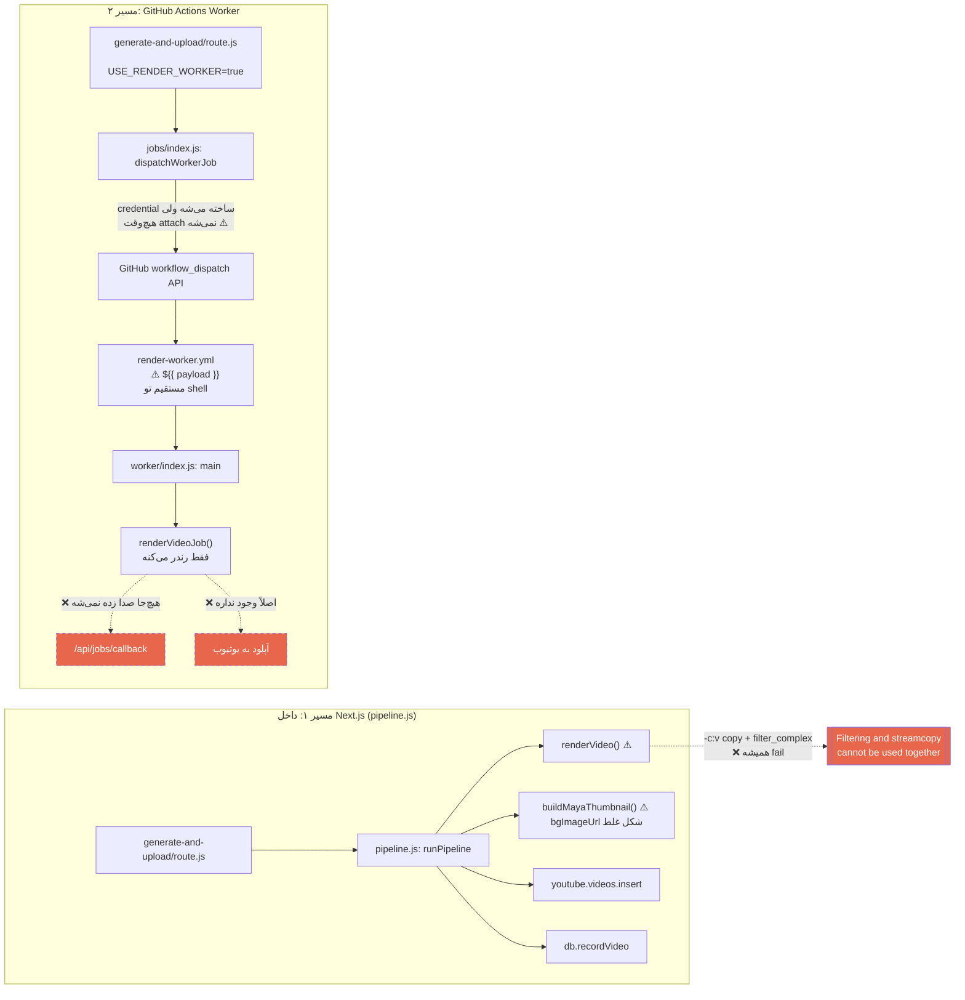
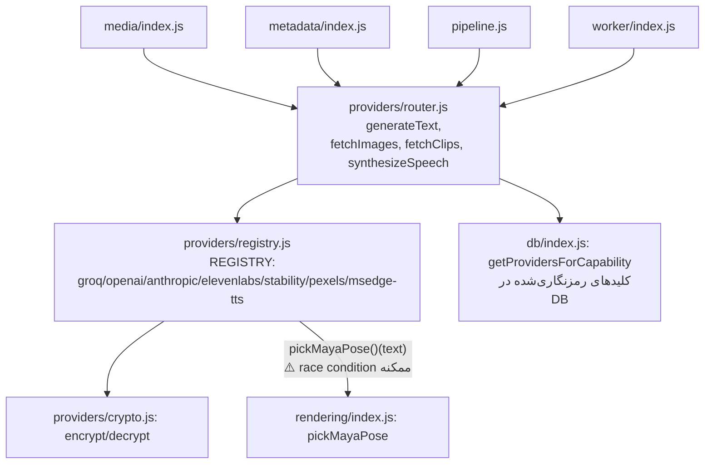

# بررسی کامل پروژه youtube-studio — گزارش باگ‌ها و گراف وابستگی

> بررسی‌شده: کل `src/`، `tests/`، `.github/workflows/`، فایل‌های config ریشه و مستندات (ROADMAP.md، WORKER_ARCHITECTURE.md، REORGANIZATION_PLAN.md).
> از بررسی خارج شدن (چون تولیدی/تاریخی‌ان، نه سورس زنده): `.next/` (build خروجی)، `node_modules/`، `apply_*.sh` و `*.zip`های ریشه (پچ‌های قدیمی).
> فقط **پیدا کردن** باگ‌ها، بدون فیکس — طبق درخواست.

---

## ۱. خلاصه اجرایی

پروژه یک اپ Next.js (App Router) با معماری سه‌لایه‌ست: صفحات React (`src/app/*/page.js` + `src/components/`) → API routeها (`src/app/api/**/route.js`) → لایه‌ی منطق (`src/lib/**`). دو مسیر رندر ویدیو موازی وجود داره: مستقیم داخل پردازش Next.js (`lib/pipeline.js`) و از طریق یک GitHub Actions worker مجزا (`src/worker/index.js`).

جمعاً **۱۷ باگ/مشکل واقعی** پیدا شد که در ۴ سطح شدت دسته‌بندی شدن. سه مورد از همه مهم‌ترن چون کل یک قابلیت اصلی رو غیرقابل‌استفاده می‌کنن:

1. **مسیر رندر لانگ‌فرم** (`renderVideo`) همیشه در مرحله‌ی آخر ترکیب صدا/ویدیو fail می‌کنه (ترکیب نامعتبر `-c:v copy` با `-filter_complex`).
2. **مسیر Worker (GitHub Actions)** هم از نظر معماری ناقصه (آپلود به یوتیوب و callback هیچ‌جا پیاده نشده) و هم دستور اجراش در YAML به‌خاطر تزریق مستقیم `${{ }}` داخل shell، با هر آپاستروف تو متنِ اسکریپت (خیلی رایج در متن انگلیسی) می‌شکنه — این دومی دقیقاً همون الگوی آسیب‌پذیریِ مستندشده‌ی خودِ GitHub برای command injection هم هست.
3. عکسِ پس‌زمینه‌ی واقعی هیچ‌وقت، از هیچ مسیری، وارد تامبنیل مایا نمی‌شه (سه باگ مستقل که همه به یک نتیجه می‌رسن).

---

## ۲. معماری کلی و گراف وابستگی

### ۲.۱ نمای کلی لایه‌ها

```mermaid
graph TD
    subgraph UI["صفحات (src/app/*/page.js) — همه wrapper نازک روی یک کامپوننت"]
        PG_long["/long"] --> VS
        PG_short["/short"] --> VS
        PG_ai["/ai-studio"] --> AIS
        PG_an["/analytics"] --> CA
        PG_check["/api-check"] --> AS
        PG_prov["/providers"] --> PM
        PG_sch["/schedule"] --> SS
    end

    subgraph Components["کامپوننت‌های اصلی"]
        VS[VideoStudio.js]
        AIS[AIStudio.js] --> TG[TextGenerator] & IG[ImageGenerator] & VG[VideoGenerator] & AG[AudioGenerator]
        CA[ChannelAnalytics.js]
        AS[ApiStatus.js]
        PM[ProviderManager.js]
        SS[ScheduleSettings.js]
    end

    subgraph API["API routes (src/app/api/**)"]
        R_gen[generate-and-upload]
        R_script[generate-script]
        R_tts[tts] & R_img[images] & R_clip[clips]
        R_ai[ai/generate-*]
        R_ab[ab-test]
        R_up[upload]
        R_comm[community]
        R_vid[videos]
        R_sync[sync-stats]
        R_meta[suggest-metadata]
        R_repur[repurpose]
        R_prov[providers/*]
        R_status[status/*]
        R_sched[schedules]
        R_run[scheduler/run]
        R_jobs["jobs/dispatch, jobs/callback, jobs/status"]
    end

    subgraph Lib["src/lib/**"]
        L_pipe[pipeline.js]
        L_auth[auth/authOptions.js]
        L_db[db/index.js]
        L_prov[providers/router.js + registry.js]
        L_render[rendering/index.js]
        L_maya[rendering/mayaThumbnail.js]
        L_script[script/index.js + timing.js + translate.js]
        L_meta[metadata/index.js]
        L_media[media/index.js]
        L_comm[community/index.js]
        L_an[analytics/index.js]
        L_repur[repurpose/index.js]
        L_jobs[jobs/index.js]
    end

    subgraph Worker["src/worker/index.js — پردازش جدا در GitHub Actions"]
        W[worker/index.js]
    end

    VS --> R_gen & R_up & R_ab & R_script & R_tts & R_img & R_clip
    AIS --> R_ai
    CA --> R_vid & R_sync & R_comm & R_ab
    AS --> R_status
    PM --> R_prov
    SS --> R_sched & R_run

    R_gen --> L_pipe
    R_gen -->|"USE_RENDER_WORKER=true"| L_jobs
    L_jobs -->|"workflow_dispatch API"| W
    R_up --> L_render & L_maya
    R_ab --> L_render & L_maya & L_db
    R_script --> L_script
    R_tts & R_img & R_clip --> L_prov
    R_ai --> L_prov
    R_comm --> L_comm
    R_vid & R_sync --> L_db
    R_meta --> L_meta
    R_repur --> L_render & L_db
    R_prov --> L_db
    R_sched & R_run --> L_db
    R_jobs --> L_jobs & L_db

    L_pipe --> L_script & L_media & L_render & L_maya & L_db & L_meta & L_comm & L_an
    L_render --> L_maya
    L_media --> L_prov
    L_meta --> L_prov
    W --> L_render & L_maya & L_prov & L_script
```



### ۲.۲ گراف مسیر رندر (بحرانی‌ترین بخش — محل بیشتر باگ‌ها)



### ۲.۳ لایه‌ی provider ها (منبع متن/عکس/کلیپ/صدا)



---

## ۳. فهرست کامل باگ‌ها

### 🔴 بحرانی

#### باگ ۱ — رندر لانگ‌فرم همیشه در مرحله‌ی نهایی fail می‌کنه
**فایل:** `src/lib/rendering/index.js` خط ۲۶۲–۲۸۴ (تابع `renderVideo`)
**صدا زده می‌شه از:** `pipeline.js:481` و `worker/index.js:155`

```js
let filter = "[0:v]copy[v]";
if (bgmPath && fs.existsSync(bgmPath)) {
  finalArgs.push("-i", bgmPath);
  filter = `[1:a]volume=${bgmVolume}[bgm];[2:a][bgm]amix=inputs=2:duration=first[a]`; // ← overwrite نه append
} else {
  filter = "[1:a]anull[a]";
}
// ...
"-map", "[v]", "-map", "[a]", "-c:v", "copy", "-c:a", "aac"
```

سه باگ روی هم:
1. `-map [v]` که از یک `-filter_complex` میاد، با `-c:v copy` (stream-copy) ترکیب شده. ffmpeg این ترکیب رو **همیشه** رد می‌کنه با خطای `Filtering and streamcopy cannot be used together` (رفتار قطعی، نه یک حالت خاص). یعنی هر رندر لانگ‌فرم همین‌جا می‌شکنه.
2. وقتی BGM هست، `filter` به‌جای append، **overwrite** می‌شه — گره‌ی ویدیوی `[0:v]copy[v]` گم می‌شه و `-map [v]` به یک pad ناموجود اشاره می‌کنه.
3. وقتی BGM هست، `[1:a]` (صدای TTS/روایت) کم می‌شه، نه `[2:a]` (خودِ موزیک) — دقیقاً برعکسِ منطقِ مورد انتظار (باید موزیک زیر صدا خفه بشه، نه صدا زیر موزیک).

نکته: `renderVerticalShortFromSource` (مسیر شورت) این باگ رو نداره چون درست re-encode می‌کنه (`-c:v libx264`)، به همین خاطر تست‌های دستی کاربر (که رو شورت بوده) این رو لو نداده.

---

#### باگ ۲ — مسیر Worker (GitHub Actions) هم معماری‌اش ناقصه هم دستورش می‌شکنه

**۲‌الف) `render-worker.yml` خط ۸۳–۸۵ — تزریق مستقیم `${{ }}` تو shell:**
```yaml
run: |
  node src/worker/index.js "${{ github.event.inputs.job_id || ... }}" \
    "${{ github.event.inputs.job_type || ... }}" \
    '${{ github.event.inputs.payload || ... }}'
```
GitHub قبل از اجرای shell، مقادیر `${{ }}` رو مستقیم به‌صورت متن جایگزین می‌کنه (این دقیقاً همون الگوییه که خودِ مستندات امنیتی GitHub به‌عنوان نمونه‌ی آسیب‌پذیرِ کلاسیک نشون می‌ده). `payload` یک رشته‌ی JSON از عنوان/اسکریپت واقعیه — هر آپاستروف داخلش (`you're`, `don't`, `it's` — در متن انگلیسیِ معمولی خیلی رایجه) تک‌کوتیشن رو زودتر می‌بنده و کل دستور با syntax error می‌شکنه، **قبل از اینکه node اصلاً اجرا بشه**. جدا از این، این الگو رسماً همون anti-pattern امنیتیِ شناخته‌شده‌ی command injection در GitHub Actions هم هست.

**۲‌ب) `worker/index.js` — حتی اگه اجرا هم بشه، کارِ تمومی نمی‌کنه:**
- `renderVideoJob` فقط رندر می‌کنه و برمی‌گردونه؛ **هیچ‌جا** آپلود به یوتیوب، ست‌کردن تامبنیل، زیرنویس یا `db.recordVideo` نداره (که همه‌شون در `pipeline.js` هستن).
- نتیجه با `console.log("WORKER_RESULT:" + JSON.stringify(output))` چاپ می‌شه؛ `output.result.videoBuffer` یک Buffer چند مگابایتیه که `JSON.stringify` روش یک آرایه‌ی متنیِ عظیم از اعداد می‌سازه روی یک خط لاگ — برای هر ویدیوی واقعی یا truncate می‌شه یا از سقفِ لاگ GitHub Actions رد می‌شه.
- در کل فایل **هیچ فراخوانی `fetch()`ای وجود نداره** — یعنی هیچ‌وقت به `/api/jobs/callback` (که در `WORKER_ARCHITECTURE.md` مستند شده) گزارش نمی‌ده.

**۲‌ج) زیرساخت امضای HMAC قطع است:**
در `generate-and-upload/route.js` و `jobs/dispatch/route.js`، `credential = generateWorkerCredential(...)` ساخته می‌شه ولی موقع dispatch فقط `{ ...payload, signature }` ارسال می‌شه — `credential` هیچ‌وقت به payload اضافه نمی‌شه. پس چک `if (payload.credential)` در `worker/index.js` همیشه false و بی‌اثره.

---

#### باگ ۳ — عکسِ پس‌زمینه‌ی واقعی هیچ‌وقت وارد تامبنیل مایا نمی‌شه (سه مسیر مستقل، یک نتیجه)

- **مسیر خودکار:** `pipeline.js:431` → `bgImageUrl = mediaItems[0]`. آیتم‌های Pexels (provider پیش‌فرض/رایگان) شکل `{path: url}` دارن. `buildMayaThumbnail` (در `mayaThumbnail.js`) فقط دو حالت رو می‌فهمه: آبجکت با `.buffer`، یا رشته‌ی خام URL. برای `{path: url}` می‌ره تو شاخه‌ی `fetch(bgImageUrl)` که چون ورودی آبجکته نه رشته throw می‌کنه، catch می‌شه، بی‌صدا می‌فته رو گرادیانِ پیش‌فرض.
- **مسیر آپلود دستی:** `VideoStudio.js:53` — `const [videoBgImageUrl, setVideoBgImageUrl] = useState("")`. `setVideoBgImageUrl` **هیچ‌جای کامپوننت صدا زده نمی‌شه**. پس `handleUpload` همیشه `bgImageUrl=""` می‌فرسته به `/api/upload`.
- **مسیر A/B:** `ab-test/route.js` اصلاً `bgImageUrl` رو به `buildMayaThumbnail` پاس نمی‌ده.

نتیجه: در کل اپ، هیچ مسیری با موفقیت یک عکسِ پس‌زمینه‌ی واقعی به تامبنیل مایا نمی‌رسونه — همیشه گرادیانِ برند.

---

### 🟠 شدید

#### باگ ۴ — دکمه‌ی «پست کامیونیتی» در صفحه‌ی آنالیز کانال ۱۰۰٪ خراب است
`ChannelAnalytics.js` خط ۸۳: `fetch("/api/community-post", ...)` — route واقعی `/api/community`ه (پوشه‌ی `src/app/api/community-post` اصلاً وجود نداره). همیشه ۴۰۴ می‌گیره؛ `res.json()` روی صفحه‌ی HTML خطای ۴۰۴ throw می‌کنه.

#### باگ ۵ — دکمه‌های سوییچ A/B عنوان هیچ‌وقت نمایش داده نمی‌شن
`db/index.js: getAllVideos()` ستون‌های `title_b`/`active_variant` رو select نمی‌کنه (فقط `title` ساده رو می‌گیره)، ولی `ChannelAnalytics.js` خط ۳۱۲ نمایش دکمه‌های سوییچ رو دقیقاً به truthy بودن `v.title_b` گیر داده. فیچر کامل (DB + `/api/ab-test` + UI) هست ولی از UI هیچ‌وقت قابل‌دسترسی نیست.

#### باگ ۶ — next-auth: رفرش توکن گوگل روی هر درخواست صدا زده می‌شه
`src/lib/auth/authOptions.js` خط ۵۶: `token.accessTokenExpires = Date.now() + account.expires_in * 1000`. next-auth v4 برای Google، `account.expires_at` می‌ده نه `account.expires_in` — نتیجه همیشه `NaN` و همیشه رفرش صدا زده می‌شه، نه فقط وقتی واقعاً منقضی شده.

#### باگ ۷ — مسیرِ Maya در ویدیوی رندرشده (نه تامبنیل) هیچ‌وقت پیدا نمی‌شه
`rendering/index.js` خط ۱۹۳ دنبال پوزها در `public/assets/images/maya/` می‌گرده (این پوشه اصلاً وجود نداره — فقط هدف آینده در `REORGANIZATION_PLAN.md` بوده). فایل‌های واقعی در `public/maya/`ان (که `mayaThumbnail.js` درست بهش اشاره می‌کنه). چون با `fs.existsSync` گارد شده، سایلنت fail می‌شه — اورلی مایا هیچ‌وقت رو ویدیوی لانگ‌فرم ظاهر نمی‌شه.

#### باگ ۸ — race condition روی مقداردهی اولیه‌ی `pickMayaPose`
`rendering/index.js` خط ۲۰–۲۸: یک `import()` دینامیک بدون await در بارگذاری ماژول اجرا می‌شه. اگه `registry.js`ی `msedgeTts` (صدا زده‌شده در هر synthesizeSpeech) قبل از resolve شدنش اجرا بشه، ارور `"pickMayaPose not initialized yet"` می‌گیره — روی cold start (که خودِ پروژه به‌خاطر خوابیدن Render free tier باهاش آشناست) کاملاً محتمله.

#### باگ ۹ — `ImageGenerator.js` با `Buffer` مرورگر کرش می‌کنه
`components/ai-studio/ImageGenerator.js` (کامپوننت کلاینت) خط ۱۵۳ و ۱۵۹: `Buffer.from(img.buffer).toString("base64")`. `Buffer` یک global نود.جی‌اسه، تو مرورگر تعریف نشده و Next.js/webpack5 پالیفیلش نمی‌کنه. با Pexels (پیش‌فرض) دیده نمی‌شه چون آیتم‌هاش `{path:url}`ان، ولی با OpenAI/Stability (که خروجی بایت خام می‌دن) بلافاصله `ReferenceError: Buffer is not defined` می‌ده.

#### باگ ۱۰ — `worker/index.js`ی `generateScriptJob` همیشه اسکریپت `undefined` تولید می‌کنه
`src/worker/index.js` خط ۳۰۳: `const { text } = await generateText({...})`. `generateText()` (در `providers/router.js`) یک **رشته‌ی خام** برمی‌گردونه، نه `{text}`. پس `text` همیشه `undefined`ه، `JSON.parse(undefined)` throw می‌کنه، catch نتیجه‌ی `{script: undefined, ...}` برمی‌گردونه. (در تضاد با `lib/script/index.js`ی `generateScript` که همین `generateText` رو درست به‌عنوان رشته مصرف می‌کنه — فقط کپیِ داخل worker این باگ رو داره.)

---

### 🟡 متوسط

#### باگ ۱۱ — `AudioGenerator.js`: منطق انتخاب صدای پیش‌فرض فقط یک‌بار در کل عمر کامپوننت اجرا می‌شه
```js
// Auto-select default voice when provider changes
useState(() => {
  if (provider && availableVoices.length > 0 && !voice) setVoice(availableVoices[0].id);
});
```
اینجا `useState(fn)` استفاده شده، نه `useEffect(fn, [deps])`. `fn` تو `useState` فقط initializer مقدارِ اولیه‌ست و React تضمین می‌ده دقیقاً یک‌بار در mount اجرا بشه — نه هر بار که `provider` عوض بشه. وقتی کاربر provider رو عوض می‌کنه (`setVoice("")` صدا زده می‌شه)، این منطق دیگه هیچ‌وقت دوباره اجرا نمی‌شه، پس `voice` خالی می‌مونه ولی دراپ‌داون بصری یک گزینه نشون می‌ده — دکمه‌ی «تولید صدا» غیرفعال می‌مونه بدون دلیل واضح برای کاربر.

#### باگ ۱۲ — تکرارِ منطق رندر شورت با escaping ناهماهنگ
دو پیاده‌سازیِ تقریباً یکسانِ رندر عمودیِ شورت وجود داره:
- `rendering/index.js: renderVerticalShortFromSource` (مسیر `/api/repurpose`) — escaping ضعیف‌تر (فقط `'`, `:`, `%`)
- `worker/index.js: renderShortJob` (مسیر job) — escaping قوی‌تر (`\`, `[`, `]` رو هم می‌گیره)
اگه کپشن (مثلاً بعد از ترجمه) بک‌اسلش یا براکت داشته باشه، مسیر `/api/repurpose` می‌تونه filter_complex نامعتبر بسازه؛ مسیر worker امن‌تره. کد کپی‌شده‌ست و در یک‌جا فیکس شده، در جای دیگه نه.

#### باگ ۱۳ — fallback مدیای دانلود‌نشده باعث کرش می‌شه، نه graceful degrade
`pipeline.js` خط ۴۴۷–۴۵۹: اگه دانلود یک آیتم مدیا fail بشه، `path` (یک URL ریموت) بدون `buffer` نگه داشته می‌شه. `rendering/index.js` خط ۱۶۰–۱۶۴/۱۷۴–۱۷۷ در این حالت `fsp.copyFile(asset.path, clipPath)` صدا می‌زنه — ولی `fs.copyFile` فقط مسیر لوکال می‌فهمه، نه URL ریموت؛ throw می‌کنه و کل رندر می‌شکنه (به‌جای این‌که فقط همون سگمنت رو skip کنه).

---

### ⚪ جزئی

#### باگ ۱۴ — ۳۲ مگابایت wasm بلااستفاده
`public/ffmpeg-core/ffmpeg-core.wasm` (۳۲ مگابایت) در ریپو هست ولی `VideoStudio.js` خط ۳۰۰ واقعاً از CDN خارجی (`unpkg.com`) استفاده می‌کنه، نه از مسیر لوکال `/ffmpeg-core/`.

#### باگ ۱۵ — `BATCH_SIZE` export بی‌اثر
`rendering/index.js` مقدار `BATCH_SIZE=1` رو export می‌کنه با کامنتی که ادعای محدودکردنِ حافظه داره، ولی هیچ‌جای کد ازش برای batch کردن واقعی استفاده نمی‌شه (پردازش از قبل sequential/تک‌تک هست).

#### باگ ۱۶ — export های ناسازگار در بارِل کلی `lib/index.js`
`export * from './media'` و `export * from './providers'` هر دو `fetchImages`/`fetchClips`/`extractKeywords` رو export می‌کنن — یک ambiguous re-export که طبق مشخصات ES modules بی‌خطره چون این بارل مستقیم `import` نمی‌شه هیچ‌جا، ولی اگه یه‌روز کسی از `@/lib` مستقیم import کنه می‌ترکه.

#### باگ ۱۷ — export های مرده و پوشه‌های خالی از یک reorganization نصفه‌کاره
- `script/timing.js`ی `escapeDrawtext` و `splitSentences` هیچ‌جا import نمی‌شن (هرکدوم یک نسخه‌ی محلیِ دیگه داره).
- پوشه‌های خالی: `src/lib/pipeline/`, `src/lib/scheduling/`, `src/app/api/render/`, `src/app/api/analytics/` (از `REORGANIZATION_PLAN.md`ی نیمه‌کاره؛ `pipeline.js` و منطق زمان‌بندی هیچ‌وقت واقعاً به این پوشه‌ها منتقل نشدن).
- `public/audio/bgm/` اصلاً وجود نداره (فیچر BGM فاز ۳ فعلاً کاملاً dormant، ولی بی‌خطر چون graceful fallback داره و خودِ `render-worker.yml` هم این غیاب رو already handle می‌کنه).

---

## ۴. مواردی که بررسی و **رد** شدن (به نظر باگ می‌رسیدن ولی عمدی/مستند بودن)

| مورد | چرا باگ نیست |
|---|---|
| `/api/status*` فقط env var قدیمی Groq/Pexels رو چک می‌کنه، نه DB providers | `ApiStatus.js` صریحاً به کاربر می‌گه این صفحه فقط legacy رو چک می‌کنه و برای بقیه به صفحه‌ی Providers ارجاع می‌ده |
| `CRON_SECRET` در `.env.example` نیست | در خودِ UI صفحه‌ی زمان‌بندی (`ScheduleSettings.js`) کامل مستند و توضیح داده شده |

---

## ۵. جدول کامل روابط فایل↔فایل (import اصلی هر فایل)

| فایل | Import اصلی از | مصرف‌کننده‌ها |
|---|---|---|
| `lib/pipeline.js` | `script/*`, `media/index.js`, `rendering/index.js`, `rendering/mayaThumbnail.js`, `db/index.js`, `metadata/index.js`, `community/index.js`, `analytics/index.js` | `api/generate-and-upload/route.js` |
| `lib/rendering/index.js` | `rendering/mayaThumbnail.js` (dynamic, بدون extension ⚠️) | `pipeline.js`, `worker/index.js`, `api/upload`, `api/ab-test`, `api/repurpose` |
| `lib/rendering/mayaThumbnail.js` | ندارد (خودکفا) | `rendering/index.js`, و مستقیم از `api/upload`, `api/ab-test` |
| `lib/providers/router.js` | `providers/registry.js` | `media/index.js`, `metadata/index.js`, `pipeline.js`, `worker/index.js`, `api/tts`, `api/images`, `api/clips`, `api/ai/*` |
| `lib/providers/registry.js` | `providers/crypto.js`, `rendering/index.js` (برای `pickMayaPose`) | `providers/router.js` |
| `lib/db/index.js` | ندارد (فقط `pg`) | تقریباً همه‌ی API routeها |
| `lib/auth/authOptions.js` | ندارد | `api/auth/[...nextauth]`, `api/generate-and-upload`, `api/scheduler/run` |
| `lib/jobs/index.js` | ندارد (فقط `crypto`, `fetch`) | `api/generate-and-upload`, `api/jobs/dispatch`, `api/jobs/callback`, `api/jobs/status` |
| `worker/index.js` | `rendering/index.js`, `providers/router.js`, `script/index.js` (dynamic import) | فقط از طریق `node src/worker/index.js` در `render-worker.yml` |
| `components/studio/VideoStudio.js` | `api/generate-and-upload`, `api/upload`, `api/ab-test`, `api/generate-script`, `api/tts`, `api/images`, `api/clips` | `app/long/page.js`, `app/short/page.js` |
| `components/analytics/ChannelAnalytics.js` | `api/videos`, `api/sync-stats`, `api/community-post` ⚠️(غلط)، `api/ab-test` | `app/analytics/page.js` |

---

## ۶. اولویت پیشنهادی برای فیکس (فقط جهت‌گیری، نه دستور اجرا)

1. باگ ۱ (final mux) و باگ ۲‌الف (yaml injection) — بدون این‌ها هیچ ویدیوی لانگ‌فرم/هیچ worker jobی کار نمی‌کنه.
2. باگ ۲‌ب/۲‌ج (worker architecture gap) — نیاز به تصمیم طراحی داره (worker کامل بشه یا کلاً حذف بشه).
3. باگ ۳ (تامبنیل بدون عکس واقعی)، باگ ۷ (Maya در ویدیو نیست) — فیچرهای ساخته‌شده ولی سایلنت خراب.
4. باقی موارد شدید/متوسط بر اساس اینکه کدوم صفحه بیشتر استفاده می‌شه.
